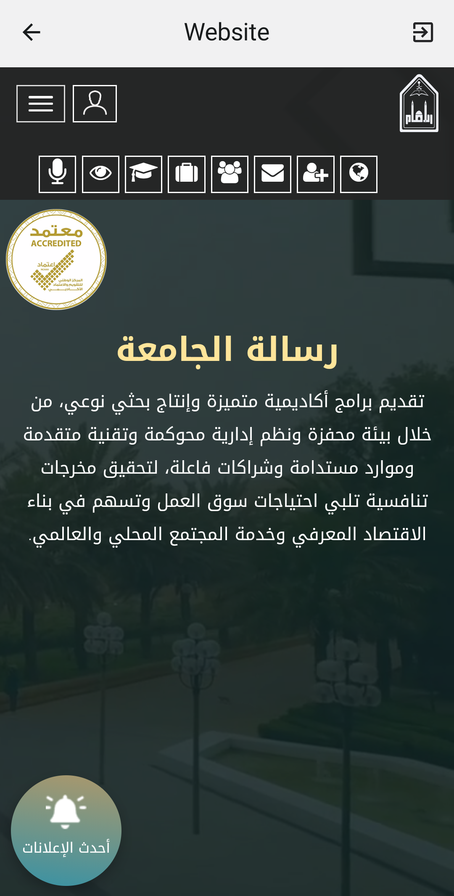
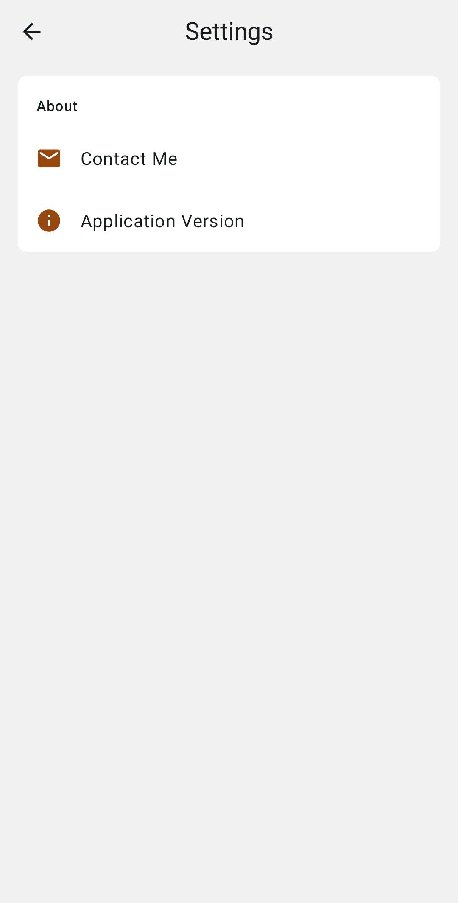

<div align="center"></div>

<h3 align="center">Saudi Universities Directory - Android</h3>

<p align="center">
    Get to know the saudi public universities affiliated to the ministry of education which includes information about these universities and their specialties.
</p>

##

<h3 align="center">Application Contains</h3>

<table align="center">
    <tr><td align="center">1</td><td>27 Saudi public universities.</td></tr>
    <tr><td align="center">2</td><td>A simple history of each university and when it was established.</td></tr>
    <tr><td align="center">3</td><td>University location if you want to go to university using (Google Maps).</td></tr>
    <tr><td align="center">4</td><td>Colleges affiliated with the university (if available).</td></tr>
    <tr><td align="center">5</td><td>News of the University (if available).</td></tr>
    <tr><td align="center">6</td><td>The official electronic services application of the university for its students (if available).</td></tr>
    <tr><td align="center">7</td><td>Communicate with the university through social media accounts.</td></tr>
</table>

<div align="center">
    <a href='https://play.google.com/store/apps/details?id=com.ss.universitiesdirectory'>
        
    </a>
</div>

##

<h3 align="center">Application Images</h3>

<div align="center" >
    
    
    
    
    
    
    
</div>

##

<h3 align="center">License</h3>

```
Copyright 2021 Abdulrahman Al-Ghamdi

Licensed under the Apache License, Version 2.0 (the "License");
you may not use this file except in compliance with the License.
You may obtain a copy of the License at

    http://www.apache.org/licenses/LICENSE-2.0

Unless required by applicable law or agreed to in writing, software
distributed under the License is distributed on an "AS IS" BASIS,
WITHOUT WARRANTIES OR CONDITIONS OF ANY KIND, either express or implied.
See the License for the specific language governing permissions and
limitations under the License.
```
